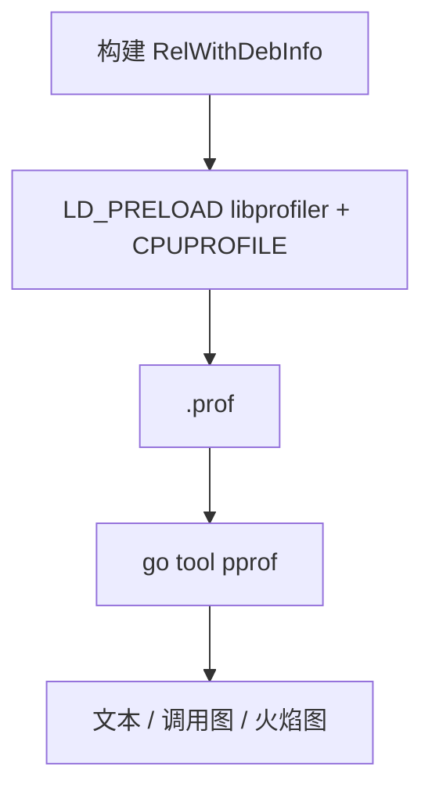
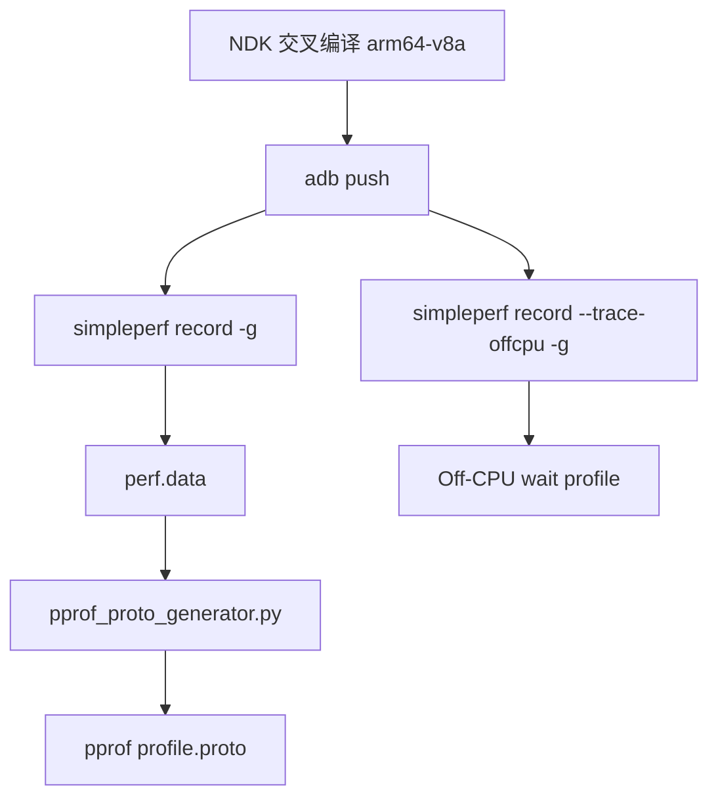

# gperftools / pprof 性能分析指南

先澄清一个常见命名混淆：GNU `gperf` 是 perfect hash 生成器，不是 profiler。
平时说"用 gperf 抓性能"通常实际指的是 `gperftools`。`gperftools` 提供
`libprofiler`，生成的 profile 可以被 Google `pprof` 读取。

## 核心概念

### profile 格式

| 来源 | 格式 | 读取方式 |
|------|------|----------|
| gperftools `libprofiler` | `.prof` | `go tool pprof` 直接读取 |
| Linux `perf record` | `perf.data` | `perf report` 或转成 proto 后 `pprof` |
| Android `simpleperf record` | `perf.data` | `pprof_proto_generator.py` 转成 proto 后 `pprof` |
| pprof 原生 | `profile.pb.gz` | `pprof` 直接读取 |

## 构建样例

```bash
cmake -B build -DCMAKE_BUILD_TYPE=RelWithDebInfo
cmake --build build -j
```

生成的二进制在 `build/bin/`：

```
sample_01_flat_vs_cum
sample_02_inline_effect
sample_03_complexity
sample_04_false_sharing
sample_05_cache_miss
sample_06_alloc_pressure
sample_07_lock_contention
```

## 安装工具

```bash
sudo apt-get install -y graphviz
```

需要的工具：`go tool pprof`（分析）、`dot`（调用图渲染）。gperftools 通过 preload 接入，见下方章节。

## Linux：gperftools → pprof



录制：

```bash
CPUPROFILE=/tmp/sample_01.prof \
LD_PRELOAD=/usr/lib/x86_64-linux-gnu/libprofiler.so \
build/bin/sample_01_flat_vs_cum
```

分析命令见 [pprof 常用命令](#pprof-常用命令)。

## Android arm64：simpleperf → pprof



交叉编译：

```bash
cmake -B build-android \
  -DCMAKE_TOOLCHAIN_FILE=$ANDROID_NDK_HOME/build/cmake/android.toolchain.cmake \
  -DANDROID_ABI=arm64-v8a \
  -DANDROID_PLATFORM=android-35 \
  -DANDROID_STL=c++_static \
  -DCMAKE_BUILD_TYPE=RelWithDebInfo
cmake --build build-android -j
```

推到设备：

```bash
adb push build-android/bin/sample_01_flat_vs_cum /data/local/tmp/
adb shell chmod +x /data/local/tmp/sample_01_flat_vs_cum
```

录制 CPU profile：

```bash
adb shell simpleperf record -g -o /data/local/tmp/perf.data -- \
  /data/local/tmp/sample_01_flat_vs_cum
adb pull /data/local/tmp/perf.data ./perf.data
```

锁竞争和 off-CPU 等待：

```bash
adb shell simpleperf record --trace-offcpu -g -o /data/local/tmp/perf.data -- \
  /data/local/tmp/sample_07_lock_contention
```

转成 pprof proto（建议先构建 binary_cache 获得完整符号）：

```bash
python binary_cache_builder.py -i perf.data -lib build-android/bin
python pprof_proto_generator.py -i perf.data -o profile.proto
pprof -http=:8080 profile.proto
```

## pprof 常用命令

```bash
# 文本报告
go tool pprof --text build/bin/<binary> /tmp/<profile>

# Web UI（火焰图 + 调用图），打开 http://localhost:8080
go tool pprof -http=:8080 build/bin/<binary> /tmp/<profile>

# 交互式 shell：top  top --cum  list <func>  web  svg  quit
go tool pprof build/bin/<binary> /tmp/<profile>

# 导出 SVG / PDF
go tool pprof --svg build/bin/<binary> /tmp/<profile> > out.svg
go tool pprof --pdf build/bin/<binary> /tmp/<profile> > out.pdf
```

## 各样例预期现象

采集方式见 [Linux：gperftools → pprof](#linux-gperftools--pprof)，将 `sample_01_flat_vs_cum` 替换为对应二进制即可。

| 样例 | 二进制 | 预期现象 |
|------|--------|----------|
| 01 Flat vs Cum | `sample_01_flat_vs_cum` | `bad_parent` 高 cum，`burn` 高 flat |
| 02 Inline Effect | `sample_02_inline_effect` | `bad_inlined_work` 消失（被内联）；`good_noinline_work` 保留独立栈帧 |
| 03 Complexity | `sample_03_complexity` | pprof 显示热点；程序打印的 timing ratio 体现复杂度增长 |
| 04 False Sharing | `sample_04_false_sharing` | 坏版本将 CPU 烧在 atomic/cache coherence 上 |
| 05 Cache Miss | `sample_05_cache_miss` | 顺序 vs 随机访问 slowdown 体现内存局部性差异 |
| 06 Alloc Pressure | `sample_06_alloc_pressure` | allocator 帧变热；free list pool 版本开销明显更低 |
| 07 Lock Contention | `sample_07_lock_contention` | on-CPU profile 看不到等锁时间；需要 `--trace-offcpu` |

## 常见问题

### profile 为空或火焰图只有 root

程序运行太短，采样器没有抓到足够样本。每个样例已经包含约 2 秒的 profiling workload；
自己写的样例应让热点持续运行至少 1—3 秒。

可以提高采样频率：

```bash
CPUPROFILE=/tmp/sample_01.prof \
CPUPROFILE_FREQUENCY=1000 \
LD_PRELOAD=/usr/lib/x86_64-linux-gnu/libprofiler.so \
build/bin/sample_01_flat_vs_cum
```

文本报告有样本但 Web UI 只有 root，先用 `--text` 确认样本数量，不要先怀疑 Web UI。

### 符号缺失

确认构建类型：

```bash
cmake -B build -DCMAKE_BUILD_TYPE=RelWithDebInfo
```

确认 CMakeLists.txt 保留了：

```cmake
add_compile_options(-fno-omit-frame-pointer -g)
```

### inlined 函数消失

这是 `sample_02_inline_effect` 的预期行为，不是问题。

### 锁竞争在 CPU profile 里看起来很小

这是 `sample_07_lock_contention` 的预期现象。线程等锁时不在 CPU 上，
默认 CPU profiler 不记录等待栈。Android 上用 simpleperf `--trace-offcpu`，
见 [Android arm64：simpleperf → pprof](#android-arm64simpleperf--pprof) 章节。
