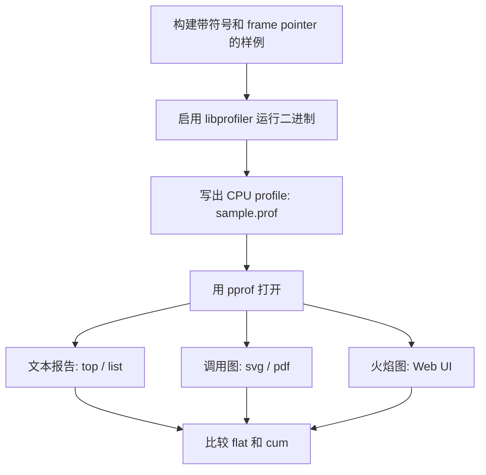
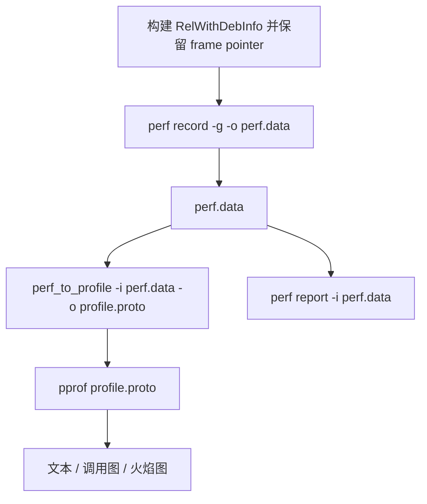
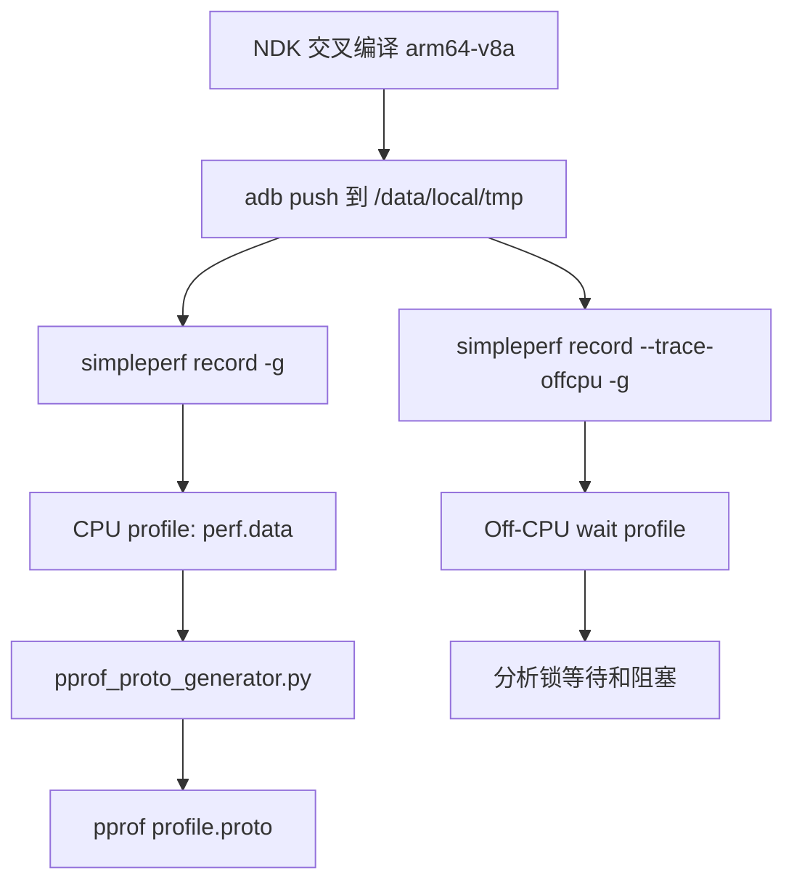
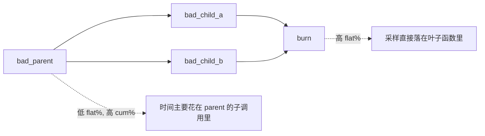

# gperftools / pprof 性能分析指南

这份文档说明如何为 `pprof_samples` 里的 C++ 样例采集 CPU profile，并用
`pprof`、Linux `perf` 或 Android `simpleperf` 分析。

先澄清一个常见命名混淆：GNU `gperf` 是 perfect hash 生成器，不是 profiler。
平时说“用 gperf 抓性能”通常实际指的是 `gperftools`。`gperftools` 提供
`libprofiler`，生成的 profile 可以被 Google `pprof` 读取。

## 构建样例

先用带调试符号和 frame pointer 的配置构建：

```bash
cmake -B build -DCMAKE_BUILD_TYPE=RelWithDebInfo
cmake --build build -j
```

生成的二进制在：

```bash
build/bin/sample_01_flat_vs_cum
build/bin/sample_02_inline_effect
build/bin/sample_03_complexity
build/bin/sample_04_false_sharing
build/bin/sample_05_cache_miss
build/bin/sample_06_alloc_pressure
build/bin/sample_07_lock_contention
```

## 安装工具

macOS + Homebrew：

```bash
brew install gperftools graphviz go
```

Ubuntu/Debian：

```bash
sudo apt-get update
sudo apt-get install -y google-perftools libgoogle-perftools-dev graphviz
```

需要的工具：

- `libprofiler`：gperftools 的 CPU profiler 运行时库。
- `go tool pprof`：读取 `.prof`、`profile.pb.gz`、部分 `perf.data` 并生成报告。
- `dot`：Graphviz 工具，用来渲染调用图。

注意：Homebrew 里的 `google-perftools` 已经重命名为 `gperftools`。当前 Homebrew
包通常只安装 `libprofiler`、`tcmalloc`、头文件和文档，不安装独立的 `pprof` 命令。
macOS 上通常使用 Go 自带的 `go tool pprof`。

## 采集流程



## `.prof`、`perf.data` 和 `profile.proto` 的区别

`gperftools` 不会录制 `perf.data`。

常见输出格式如下：

- `gperftools/libprofiler`：通过 `CPUPROFILE=/tmp/sample.prof` 写出 `.prof`。
- Linux `perf record`：写出 `perf.data`。
- Android `simpleperf record`：写出 `perf.data`。
- `pprof` 原生格式：通常是 gzipped `profile.proto`，常见扩展名是 `.pb.gz`。

如果你想走 Google `pprof` 工作流，用 `gperftools` 最直接。如果你明确需要
`perf.data`，在 Linux 用 `perf`，在 Android 用 `simpleperf`。

## macOS：用 gperftools 直接生成 pprof profile

macOS 没有 Linux `perf record -> perf.data` 这条路径，所以这条命令不是 macOS
常规用法：

```bash
perf_to_profile -i perf.data -o profile.proto
```

本项目在 macOS 上推荐直接用 gperftools 写 `.prof`。

Apple Silicon Homebrew 通常是：

```bash
CPUPROFILE=/tmp/sample_01.prof \
DYLD_INSERT_LIBRARIES=/opt/homebrew/lib/libprofiler.dylib \
build/bin/sample_01_flat_vs_cum
```

Intel Homebrew 通常是：

```bash
CPUPROFILE=/tmp/sample_01.prof \
DYLD_INSERT_LIBRARIES=/usr/local/lib/libprofiler.dylib \
build/bin/sample_01_flat_vs_cum
```

然后直接用 `pprof` 分析：

```bash
go tool pprof --text build/bin/sample_01_flat_vs_cum /tmp/sample_01.prof
go tool pprof -http=:8080 build/bin/sample_01_flat_vs_cum /tmp/sample_01.prof
```

如果你想导出成 pprof 的 protobuf 格式：

```bash
go tool pprof -proto build/bin/sample_01_flat_vs_cum /tmp/sample_01.prof > profile.pb.gz
go tool pprof --text build/bin/sample_01_flat_vs_cum profile.pb.gz
go tool pprof -http=:8080 build/bin/sample_01_flat_vs_cum profile.pb.gz
```

注意：

- `.prof` 已经可以被 `pprof` 读取，转换不是必须的。
- `profile.pb.gz` 比纯文本扩展名 `.proto` 更常见。
- macOS Instruments 可以分析程序，但不会产出 Linux `perf.data`。
- 如果 macOS 拒绝动态库注入，确认二进制不是系统保护路径下的程序，并直接运行
  `build/bin/...` 里的样例。

### macOS 系统库符号化 warning

如果看到类似输出：

```text
Local symbolization failed for libxpc.dylib: open /usr/lib/system/libxpc.dylib: no such file or directory
Some binary filenames not available. Symbolization may be incomplete.
Try setting PPROF_BINARY_PATH to the search path for local binaries.
```

这通常不是样例程序的问题。macOS 的很多系统库来自 dyld shared cache，不一定存在
`/usr/lib/system/*.dylib` 这样的实体文件，所以 `pprof` 可能无法本地符号化这些系统库。

先确认自己的样例函数是否能看到，例如：

```bash
go tool pprof --text build/bin/sample_01_flat_vs_cum /tmp/sample_01.prof
```

如果 `bad_parent`、`bad_child_a`、`bad_child_b`、`burn` 等函数能显示出来，这个 warning
可以忽略。

如果自己的二进制也找不到，显式设置本项目二进制搜索路径：

```bash
PPROF_BINARY_PATH="$PWD/build/bin:$PWD/build" \
go tool pprof -http=:8080 build/bin/sample_01_flat_vs_cum /tmp/sample_01.prof
```

也可以检查二进制里是否有符号：

```bash
nm -an build/bin/sample_01_flat_vs_cum | grep bad_parent
```

### macOS 上只有 `[sample_...]`，没有函数名

如果文本报告类似：

```text
File: sample_01_flat_vs_cum
Type: cpu
Showing nodes accounting for 563ms, 99.65% of 565ms total
      flat  flat%   sum%        cum   cum%
     563ms 99.65% 99.65%      565ms   100%  [sample_01_flat_vs_cum]
         0     0% 99.65%      565ms   100%  [libxpc.dylib]
```

说明已经采到样本，但符号化只到了二进制文件级别，没有解析到函数名。

先确认二进制里确实有符号：

```bash
nm -an build/bin/sample_01_flat_vs_cum | grep bad_parent
```

如果能看到类似 `__ZL10bad_parentv`，说明编译产物没问题。这个现象通常是因为你用的是
Go pprof 对 gperftools legacy `.prof` 里的 Mach-O/PIE 地址符号化不完整。当前
Homebrew `gperftools` 又不提供独立 `pprof` 命令，所以这不是简单换命令能解决的问题。

可以用 `atos` 证明地址本身能被 macOS 符号化。先从 `go tool pprof --raw` 里找一个
`sample_01_flat_vs_cum` 的地址和 mapping 起始地址，例如：

```bash
go tool pprof --raw build/bin/sample_01_flat_vs_cum /tmp/sample_01.prof
```

然后手动验证：

```bash
atos -o build/bin/sample_01_flat_vs_cum -l 0x104860000 0x104860d78
```

如果 `atos` 能输出 `burn`、`bad_parent` 等函数，而 `go tool pprof` 仍只显示
`[sample_01_flat_vs_cum]`，说明卡在 pprof 的 Mach-O 符号化兼容性。

实用建议：

- 在 macOS 上用 gperftools `.prof` 可以确认是否采到样本，但函数级 pprof flame graph
  可能不可靠。
- 需要稳定的 pprof 函数级火焰图时，在 Linux 上用 gperftools 或 `perf` 跑这些样例。
- Android 上用 `simpleperf`，再用 `pprof_proto_generator.py` 转成 pprof profile。

## Linux：录制 `perf.data`

用 Linux `perf` 录制调用栈：

```bash
perf record -g -o perf.data -- build/bin/sample_01_flat_vs_cum
```

查看交互式报告：

```bash
perf report -i perf.data
```

输出文本报告：

```bash
perf report -i perf.data --stdio
```

指定采样频率：

```bash
perf record -F 997 -g -o perf.data -- build/bin/sample_01_flat_vs_cum
```

本项目已经保留 frame pointer：

```cmake
add_compile_options(-fno-omit-frame-pointer -g)
```

如果调用栈仍然不完整，可以试 DWARF unwinding：

```bash
perf record --call-graph dwarf -o perf.data -- build/bin/sample_01_flat_vs_cum
```

## Linux：把 `perf.data` 转成 pprof 可分析的 proto

Linux `perf.data` 可以用 Google `perf_data_converter` 里的 `perf_to_profile`
转换成 pprof 兼容的 protobuf profile。

构建 `perf_to_profile`：

```bash
git clone https://github.com/google/perf_data_converter.git
cd perf_data_converter
bazel build src:perf_to_profile
```

把 Bazel 输出目录放进 `PATH`，或者直接用完整路径调用：

```bash
export PATH="$PWD/bazel-bin/src:$PATH"
```

转换：

```bash
perf_to_profile -i perf.data -o profile.proto
```

用 `pprof` 分析转换结果：

```bash
pprof --text build/bin/sample_01_flat_vs_cum profile.proto
pprof -http=:8080 build/bin/sample_01_flat_vs_cum profile.proto
```

如果 `perf_to_profile` 在 `PATH` 里，较新的 `pprof` 可以自动调用它：

```bash
pprof -http=:8080 build/bin/sample_01_flat_vs_cum perf.data
```

Linux 流程图：



## Android arm64：构建和运行样例

Android 上通常不用 gperftools，推荐 `simpleperf`。

用 Android NDK 交叉编译：

```bash
cmake -B build-android \
  -DCMAKE_TOOLCHAIN_FILE=$ANDROID_NDK_HOME/build/cmake/android.toolchain.cmake \
  -DANDROID_ABI=arm64-v8a \
  -DANDROID_PLATFORM=android-23 \
  -DANDROID_STL=c++_static \
  -DCMAKE_BUILD_TYPE=RelWithDebInfo
cmake --build build-android -j
```

推到设备运行：

```bash
adb push build-android/bin/sample_01_flat_vs_cum /data/local/tmp/
adb shell chmod +x /data/local/tmp/sample_01_flat_vs_cum
adb shell /data/local/tmp/sample_01_flat_vs_cum
```

## Android：录制 `perf.data`

录制 CPU samples：

```bash
adb shell simpleperf record -g -o /data/local/tmp/perf.data -- \
  /data/local/tmp/sample_01_flat_vs_cum
```

在设备上查看：

```bash
adb shell simpleperf report -i /data/local/tmp/perf.data -g
```

拉到 host：

```bash
adb pull /data/local/tmp/perf.data ./perf.data
```

锁竞争和 off-CPU 等待用：

```bash
adb shell simpleperf record --trace-offcpu -g -o /data/local/tmp/perf.data -- \
  /data/local/tmp/sample_07_lock_contention
adb shell simpleperf report -i /data/local/tmp/perf.data -g
```

## Android：把 `simpleperf perf.data` 转成 pprof proto

Android simpleperf 自带的 host 脚本 `pprof_proto_generator.py` 可以读取
`perf.data` 并生成 pprof profile。

基本转换：

```bash
python pprof_proto_generator.py -i perf.data -o profile.proto
```

用 `pprof` 打开：

```bash
pprof --text profile.proto
pprof -http=:8080 profile.proto
```

为了拿到更完整的符号和源码行号，建议先构建 `binary_cache`。Android 采集文件里
记录的是设备路径，host 侧需要知道对应的未 strip 二进制在哪里。

```bash
python binary_cache_builder.py -i perf.data -lib build-android/bin
python pprof_proto_generator.py -i perf.data -o profile.proto
pprof -http=:8080 profile.proto
```

脚本默认：

- 输入：`perf.data`
- 输出：`pprof.profile`

所以默认文件名下也可以直接运行：

```bash
python pprof_proto_generator.py
pprof --text pprof.profile
```

Android 流程图：



## 通过 preload 使用 gperftools

这种方式不需要把样例二进制显式链接到 gperftools。

Linux：

```bash
CPUPROFILE=/tmp/sample_01.prof \
LD_PRELOAD=/usr/lib/x86_64-linux-gnu/libprofiler.so \
build/bin/sample_01_flat_vs_cum
```

macOS Apple Silicon：

```bash
CPUPROFILE=/tmp/sample_01.prof \
DYLD_INSERT_LIBRARIES=/opt/homebrew/lib/libprofiler.dylib \
build/bin/sample_01_flat_vs_cum
```

macOS Intel：

```bash
CPUPROFILE=/tmp/sample_01.prof \
DYLD_INSERT_LIBRARIES=/usr/local/lib/libprofiler.dylib \
build/bin/sample_01_flat_vs_cum
```

## 显式链接 `libprofiler`

当 preload 不方便时，可以临时把目标链接到 `profiler`：

```cmake
target_link_libraries(sample_01_flat_vs_cum PRIVATE profiler)
```

然后运行：

```bash
CPUPROFILE=/tmp/sample_01.prof build/bin/sample_01_flat_vs_cum
```

如果项目要保持无外部依赖，不建议把这个链接关系长期提交到样例工程里。

## 查看文本报告

查看最热函数：

```bash
pprof --text build/bin/sample_01_flat_vs_cum /tmp/sample_01.prof
```

进入交互式 shell：

```bash
pprof build/bin/sample_01_flat_vs_cum /tmp/sample_01.prof
```

常用交互命令：

```text
top
top --cum
list bad_parent
list bad_child_a
web
svg
quit
```

## 渲染调用图

生成 SVG：

```bash
pprof --svg build/bin/sample_01_flat_vs_cum /tmp/sample_01.prof > sample_01.svg
```

生成 PDF：

```bash
pprof --pdf build/bin/sample_01_flat_vs_cum /tmp/sample_01.prof > sample_01.pdf
```

## 打开 pprof Web UI

如果你的 `pprof` 支持 Web UI：

```bash
pprof -http=:8080 build/bin/sample_01_flat_vs_cum /tmp/sample_01.prof
```

然后打开：

```text
http://localhost:8080
```

重点看 Flame Graph 和 Graph 两个视图。

## 如何理解 flat 和 cum



- `flat`：采样直接落在这个函数自身的比例。
- `cum`：这个函数自身加上所有被它调用的子函数的累计比例。
- wrapper 函数经常是低 `flat`、高 `cum`。
- 热循环所在的叶子函数通常是高 `flat`。

## 每个样例的推荐命令

以下命令以 Linux `LD_PRELOAD` 为例。macOS 把 `LD_PRELOAD=...` 换成
`DYLD_INSERT_LIBRARIES=...`。

### 01 Flat vs Cum

```bash
CPUPROFILE=/tmp/01.prof LD_PRELOAD=/usr/lib/x86_64-linux-gnu/libprofiler.so \
  build/bin/sample_01_flat_vs_cum
pprof --text build/bin/sample_01_flat_vs_cum /tmp/01.prof
pprof -http=:8080 build/bin/sample_01_flat_vs_cum /tmp/01.prof
```

预期现象：

- `bad_parent` 应该有较高累计开销。
- 子函数或 `burn` 应该承担主要 flat 开销。

### 02 Inline Effect

```bash
CPUPROFILE=/tmp/02.prof LD_PRELOAD=/usr/lib/x86_64-linux-gnu/libprofiler.so \
  build/bin/sample_02_inline_effect
pprof --text build/bin/sample_02_inline_effect /tmp/02.prof
```

预期现象：

- `bad_inlined_work` 可能消失，因为它被 `always_inline`。
- `good_noinline_work` 应该保留独立栈帧。

### 03 Complexity

```bash
CPUPROFILE=/tmp/03.prof LD_PRELOAD=/usr/lib/x86_64-linux-gnu/libprofiler.so \
  build/bin/sample_03_complexity
pprof --text build/bin/sample_03_complexity /tmp/03.prof
```

预期现象：

- pprof 告诉你热点在哪里。
- 程序打印的不同 N 的 timing ratio 告诉你复杂度如何增长。

### 04 False Sharing

```bash
CPUPROFILE=/tmp/04.prof LD_PRELOAD=/usr/lib/x86_64-linux-gnu/libprofiler.so \
  build/bin/sample_04_false_sharing
pprof --text build/bin/sample_04_false_sharing /tmp/04.prof
```

预期现象：

- 两个版本源码层面的逻辑工作类似。
- 坏版本把 CPU 烧在 atomic/cache coherence 上。

### 05 Cache Miss

```bash
CPUPROFILE=/tmp/05.prof LD_PRELOAD=/usr/lib/x86_64-linux-gnu/libprofiler.so \
  build/bin/sample_05_cache_miss
pprof --text build/bin/sample_05_cache_miss /tmp/05.prof
```

预期现象：

- 顺序访问和随机访问都是 `O(n)`。
- 打印出来的 slowdown 体现内存局部性差异。

### 06 Allocation Pressure

```bash
CPUPROFILE=/tmp/06.prof LD_PRELOAD=/usr/lib/x86_64-linux-gnu/libprofiler.so \
  build/bin/sample_06_alloc_pressure
pprof --text build/bin/sample_06_alloc_pressure /tmp/06.prof
```

预期现象：

- allocator 相关帧可能变热。
- 固定大小对象用 free list pool 可以明显降低分配开销。

### 07 Lock Contention

```bash
CPUPROFILE=/tmp/07.prof LD_PRELOAD=/usr/lib/x86_64-linux-gnu/libprofiler.so \
  build/bin/sample_07_lock_contention
pprof --text build/bin/sample_07_lock_contention /tmp/07.prof
```

预期现象：

- CPU profiler 主要看到 on-CPU 工作。
- 线程等锁的 wall time 可能很大，但在 CPU samples 里不明显。
- 需要 off-CPU profiler，例如 `simpleperf record --trace-offcpu -g`。

## 常见问题

### profile 文件为空

程序可能结束太快。增加样例里的 work，或者循环运行被测程序。

### 火焰图只有 root

最常见原因也是程序太快，采样器没有抓到足够 on-CPU 样本。gperftools 默认采样频率
不高，如果被测热点只跑几毫秒，Web UI 里可能只剩 `root`。

处理方法：

```bash
CPUPROFILE=/tmp/sample_01.prof \
DYLD_INSERT_LIBRARIES=/opt/homebrew/lib/libprofiler.dylib \
build/bin/sample_01_flat_vs_cum
```

确认输出里有：

```text
== profiling workload ==
profile workload rounds: ...
```

`sample_01_flat_vs_cum` 已经包含约 2 秒的 profiling workload，专门给 pprof 采样。
如果你自己写新样例，也应该让热点持续运行至少 1 到 3 秒。

也可以提高 gperftools 的采样频率：

```bash
CPUPROFILE=/tmp/sample_01.prof \
CPUPROFILE_FREQUENCY=1000 \
DYLD_INSERT_LIBRARIES=/opt/homebrew/lib/libprofiler.dylib \
build/bin/sample_01_flat_vs_cum
```

然后看文本报告是否有样本：

```bash
go tool pprof --text build/bin/sample_01_flat_vs_cum /tmp/sample_01.prof
```

如果文本报告里也只有 `root` 或样本数很少，先增加 workload 时长，不要先怀疑 Web UI。

### 符号缺失

确认构建类型是：

```bash
-DCMAKE_BUILD_TYPE=RelWithDebInfo
```

并保留：

```cmake
add_compile_options(-fno-omit-frame-pointer -g)
```

### inlined 函数消失

这是 `sample_02_inline_effect` 的预期行为。优化构建会把被内联函数的指令归到
caller 上。

### 锁竞争在 CPU profile 里看起来很小

这是 `sample_07_lock_contention` 在 on-CPU profile 里的预期现象。锁等待时线程
不在 CPU 上运行，默认 CPU profiler 不会充分显示等待栈。用 off-CPU：

```bash
simpleperf record --trace-offcpu -g
```
